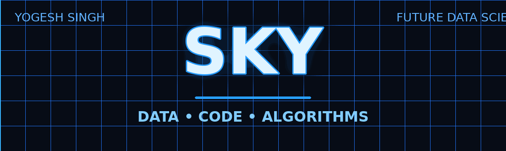

<!--
  SKY • YOGESH SINGH
  GitHub Profile README
-->

  

  <h1>Hi, I'm SKY 👋</h1>

  <h3>Future Data Scientist | Python | DSA | C++</h3>

  

    <i>"You know coding, I know business — together, we make millions."</i>
  

  

    🇮🇳 India &nbsp;•&nbsp; Building skills &nbsp;•&nbsp; Solving problems &nbsp;•&nbsp; Thinking in data
  

🧠 About Me

I'm Yogesh Singh, also known as SKY.

I'm building my path toward Data Science while strengthening my foundation in
DSA, C++, Python, databases and Linux.

My approach is simple:

Learn → Build → Solve → Improve

Currently, I'm focused on Python libraries used in Data Science, mastering DSA in C++,
and learning the fundamentals of Java.

⚡ Tech Stack

💻 Languages

  

Technology

Level / Focus

🐍 Python

Core + Data Science

⚡ C++

Advanced + DSA

☕ Java

Currently learning basics

🗄️ SQL

Basic

📊 Data Science

  

NumPy • Pandas • Python Data Science Libraries

Currently expanding my Python ecosystem for data analysis and future Data Science work.

🧩 Computer Science

DSA • DBMS • OOP in Python • Linux

🛠️ Tools

  

Git • GitHub • Linux / WSL • VS Code

🚀 What I'm Working On

Python Data Science
        ↓
NumPy → Pandas → Data Analysis → More DS Libraries
        ↓
        📊

DSA in C++
        ↓
Arrays → Sorting → Linked List → Core Algorithms
        ↓
        ⚡

Computer Science
        ↓
DBMS → SQL → OOP → Linux
        ↓
        🧠

📈 GitHub Dashboard

  
  

   

  

🧪 Projects

🚧 Project section intentionally kept open.

I'm currently building my skill foundation. Real projects will be added here as I build them.

PROJECTS
──────────────
[ coming soon ]

Build something → Push it → Document it → Add it here.

📚 Currently Learning

🐍 Python libraries used in Data Science

📊 NumPy & Pandas

⚡ DSA mastery with C++

☕ Java fundamentals

🗄️ SQL & DBMS fundamentals

🐧 Linux

🔧 Git & GitHub workflow

🎯 My Learning Philosophy

Don't just learn syntax.

Understand → Practice → Build → Break → Debug → Repeat

🌐 Connect With Me

 

📧 yogeshsingh4088@gmail.com

🇮🇳 India

⚡ SKY

Code with logic. Learn with purpose. Build for the future.

